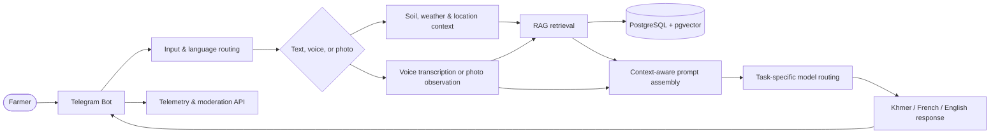

# Krova Agri

[](https://github.com/Krova-Lab/agribot/actions/workflows/ci.yml)

<p align="center">
  <strong>A practical, multilingual agricultural assistant for Cambodian farmers.</strong><br>
  Delivered through Telegram. Grounded in local context. Designed for real field conditions.
</p>

<p align="center">
  <a href="https://github.com/Krova-Lab/agribot"></a>
  <a href="https://github.com/Krova-Lab/agribot/blob/main/LICENSE"></a>
  
  
  
</p>

> Krova Agri is an open-source agritech platform built to make useful, responsible agricultural guidance more accessible to Cambodian farmers and field technicians.

## Why Krova Agri

Smallholder farmers need answers that are understandable, local, and actionable — not generic chatbot content. Krova Agri combines conversational access with a curated agricultural knowledge base and practical safety guardrails.

- **Built for the field:** farmers can ask questions by text, voice message, or photo from Telegram.
- **Multilingual by design:** Khmer-first interaction with French and English support.
- **Evidence-grounded answers:** retrieved agricultural sources are stored and searched locally through PostgreSQL and `pgvector`.
- **Multimodal assistance:** crop photos can be analysed alongside botanical identification data from Pl@ntNet.
- **Responsible recommendations:** uncertainty is surfaced, unsupported protocols are not invented, and chemical advice is handled cautiously.
- **Designed for Cambodia:** advice can account for local crops, wet and dry seasons, soil conditions, irrigation, and locally available practices.
- **Open core, protected expertise:** the public repository contains the reusable platform; private production prompts and operational data stay isolated.

## Current status

Krova Agri is in an active pilot and hardening phase.

| Area | Status |
| --- | --- |
| Telegram text conversations | Ready for pilot use |
| Voice messages and audio interpretation | Implemented |
| Crop-photo analysis | Implemented |
| Pl@ntNet botanical identification | Integrated |
| Local RAG with PostgreSQL and `pgvector` | Implemented |
| Soil and weather context | Integrated for user-shared coordinates; not inferred from a default city |
| Moderation and interaction telemetry API | Implemented |
| Khmer / French / English routing | Implemented |
| Prompt and secret separation | Implemented |
| Wider public rollout and evaluation at scale | In progress |

## Architecture



### Main components

- `bot_telegram.py` — Telegram gateway for text, voice, photo, language detection, access control, feedback, and interaction logging.
- `llm_adapter.py` — task-specific model routing and bounded failover to GPT-4o.
- `media_pipeline.py` — voice transcription or cautious image observation before retrieval.
- `rag_search.py` — semantic retrieval of approved passages with verified source URLs, plus structured retrieval provenance.
- `web_research.py` — on-demand Google Search grounding for substantive agricultural questions, with search queries and citations retained.
- `ingest_files.py` / `ingest_daemon.py` — validation, chunking, embedding, and ingestion of approved documents.
- `api_server.py` — REST API for telemetry, moderation, and controlled promotion of verified knowledge into the RAG pipeline.
- `config/` — prompt loading and the community-safe prompt example. Private production prompts are intentionally excluded from Git.
- `corpus_pipeline/` — optional preparation tools for turning source datasets into ingestible RAG documents.

### Models

- **Conversation and vision:** `gemini-3.6-flash` by default, with GPT-4o as a configurable backup.
- **Voice transcription:** `gemini-3.6-flash` by default.
- **Semantic embeddings:** `models/gemini-embedding-001`
- **Vector store:** PostgreSQL 16 with `pgvector`

Text, voice, and photo now have separate inference routes. Speech is transcribed and photos are described before vector retrieval; the response model receives the same retrieved context regardless of provider. Embeddings remain on Gemini so existing vectors stay compatible. Route configuration and evaluation instructions are in [docs/model-routing.md](docs/model-routing.md).

Historical vectors remain in `knowledge_base` and are not re-embedded. Retrieval
requires both an approved review status and verified, structured source
provenance (URL, publisher, publication date, licence, and page/section where
available). Documents without that record remain stored but are not offered as
evidence. The historical `agri_hf_` export remains excluded pending a source
quality review. New ingestion records a `.source.json` sidecar and always starts
as unverified/pending; a filename or an OCR claim is not a citation.

Substantive agricultural questions also receive a Google Search grounding pass
by default, independently of the model selected to write the final answer.
Grounding queries and returned citation URLs are stored with the interaction;
the bot only says it checked the Web when the provider returned verifiable
grounding sources. See [the provenance and web research workflow](docs/rag-provenance-and-web-research.md).

## Data and safety boundaries

The platform separates application code from operational knowledge and user data:

- `rag_dropzone/` — incoming documents awaiting validation.
- `rag_processed/` — validated and ingested documents.
- `rag_rejected/` and `rag_failed/` — quarantined or failed items.
- `data_ingest/`, media caches, backups, database dumps, logs, and runtime state — local-only and excluded from version control.
- `config/prompts.json` — private production configuration, ignored by Git.
- `config/prompts.example.json` — anonymised configuration shipped for the open-source community.

If private prompts are unavailable, the application falls back to the community example and then to a minimal safe configuration. This keeps public clones usable without exposing production intellectual property.

## Quick start

### Requirements

- Python 3.11+
- PostgreSQL 16 with `pgvector`
- Telegram bot token
- Gemini API key
- Optional GPT-4o backup credentials
- Optional: Pl@ntNet API key for botanical identification

### Install

```bash
git clone https://github.com/Krova-Lab/agribot.git
cd agribot

python3 -m venv .venv
source .venv/bin/activate
pip install -r requirements.txt
cp .env.example .env
```

Set credentials in `.env` and start PostgreSQL with the `vector` extension enabled. The public clone automatically uses `config/prompts.example.json`; production deployments should provide the private `config/prompts.json` out of band.

### Run the services

```bash
# Telegram bot
python bot_telegram.py

# REST API
uvicorn api_server:app --host 0.0.0.0 --port 8000

# Ingest approved documents from the dropzone
python ingest_files.py
```

For local development, `docker compose up -d postgres` can be used to start the PostgreSQL service defined in `docker-compose.yml`.

## Knowledge ingestion workflow

```text
Source documents / optional datasets
              ↓
        rag_dropzone/
              ↓
 Source manifest + validation, sanitisation & prompt-injection checks
              ↓
     Chunking + Gemini embeddings (pending review)
              ↓
  Human source verification and approval
              ↓
       PostgreSQL / pgvector
              ↓
        Retrieval for the bot
```

The retrieval layer is deliberately local to the deployment. Hugging Face datasets may be used as optional source material during corpus preparation; the running bot queries the local PostgreSQL knowledge base rather than a remote Hugging Face Space.

### Pilot safeguards and current limits

- Krova Agri is independent of CARDI, MAFF, and other institutions. Institutional attribution requires a specific, verifiable reference; a document title alone is insufficient.
- The retired `ingest_rag.py` seeder is disabled because it created three unsourced summaries labelled as institutional material. Retrieval excludes those exact legacy titles if they remain in an existing database. This change does not delete production records; the deployed corpus still needs a provenance review.
- Without user-shared coordinates, the bot uses Cambodia as its geographic scope and does not request plot-level soil or weather data. A place written in a message can inform qualitative advice, but is not yet geocoded into a plot location. Telegram location sharing is optional.
- Generated replies are sent as plain text and common Markdown markers are removed before delivery. This avoids showing raw `**` and heading markers in Telegram.

## Roadmap

- Expand field testing with farmers and agricultural extension partners.
- Improve Khmer agricultural terminology coverage and speech quality.
- Add stronger retrieval evaluation, source confidence, and answer traceability.
- Separate bot-specific instructions from Telegram orchestration into versioned, testable prompt configuration. The public example already lives in `config/`, but runtime rules are still assembled in `bot_telegram.py`.
- Evaluate location extraction from written, spoken, and visual context, with confirmation when ambiguous; keep GPS sharing optional.
- Review existing corpus provenance before restoring legacy passages to retrieval.
- Strengthen deployment observability, rate controls, and multilingual safety evaluation.
- Publish reusable agritech components while keeping sensitive operational data isolated.
- Evaluate additional messaging channels such as WhatsApp and Messenger.
- Explore a dedicated mobile application for farmers and field technicians.

## Contributing

Contributions are welcome, especially in:

- Khmer language quality and localisation
- agricultural data provenance and licensing
- retrieval evaluation and source ranking
- accessibility for low-bandwidth and mobile users
- safe multimodal interaction design

Please avoid committing API keys, user data, RAG documents, media, database dumps, or private prompt files. See `.gitignore` and the public prompt example before opening a pull request.

The private repository is the source of truth. A filtered GitHub Actions workflow publishes its safe subset to [the public mirror](https://github.com/Krova-Lab/agribot), where the public CI pipeline repeats the compilation, smoke-test, and Docker checks.

## License

See [LICENSE](LICENSE).

## Contact and collaboration

Krova Agri is developed by **Krova Lab** as an open-source foundation for practical, responsible agricultural assistance in Cambodia.
